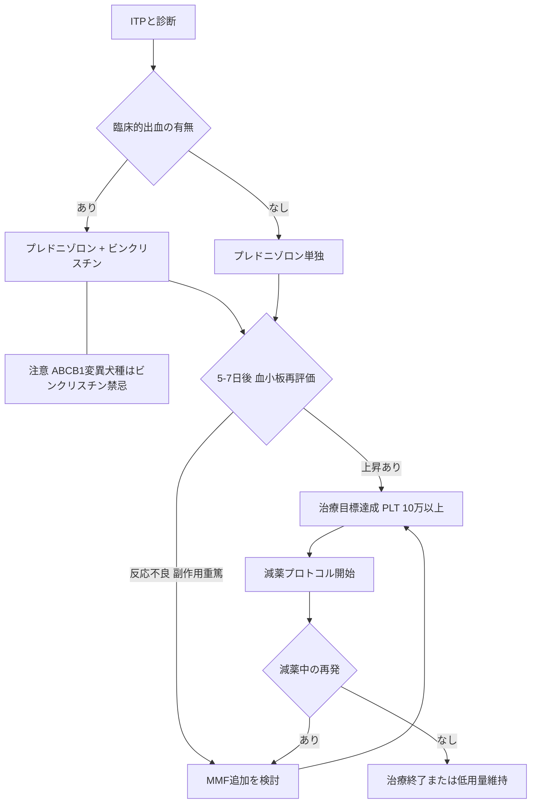

# 🩸 犬の免疫介在性血小板減少症（ITP）─ 診断と治療

> ⏱️ **読了時間**: 約5分
> 📄 **参照論文**: 6本

---

## 🎯 結論

ITPは犬で最も多い後天性出血障害。 血小板数＜20,000/μLはITPを強く支持 （＞50,000では他疾患の検討を）。
                    ACVIM 2024ガイドラインでは、 免疫抑制量のプレドニゾロンが第一選択 。
                    臨床的に有意な出血がある場合は ビンクリスチン0.02mg/kg IV単回 を初日から併用 → 血小板回復を加速し入院日数を短縮。
                    プレドニゾロンに5〜7日で反応しない、副作用が重い、減薬中に再発する場合は ミコフェノール酸モフェチル（MMF） の追加を検討。
                    治療のゴールは 血小板≥100,000/μLで出血なし 。
                    ABCB1（MDR1）変異犬種にはビンクリスチン禁忌 → 事前に品種を確認。 graph TD
    A["ITPと診断"] --> B{"臨床的出血の有無"}
    B -->|"あり"| C["プレドニゾロン + ビンクリスチン"]
    B -->|"なし"| D["プレドニゾロン単独"]

    C --- E["注意 ABCB1変異犬種はビンクリスチン禁忌"]

    C --> F{"5-7日後 血小板再評価"}
    D --> F

    F -->|"上昇あり"| G["治療目標達成 PLT 10万以上"]
    F -->|"反応不良 副作用重篤"| H["MMF追加を検討"]

    G --> I["減薬プロトコル開始"]
    I --> J{"減薬中の再発"}
    J -->|"あり"| H
    J -->|"なし"| K["治療終了または低用量維持"]

    H --> G

---

## 🗺️ ITP診断の要点（ACVIM 2024）

| 血小板数 | 解釈 | 次のアクション |
|:---|:---|:---|
| **＜20,000/μL** | ITPを強く支持（偽性血小板減少を塗抹で除外後） | **治療開始** + 原因疾患の検索を並行 |
| **20,000〜50,000/μL** | ITPの可能性あるが、他の原因も十分に検討 | 骨髄検査・感染症検査・画像を検討 |
| **50,000〜100,000/μL** | 原発性ITP単独での低下としてはやや高い、二次性の検索を | DIC・感染・腫瘍・薬剤性を積極的に除外 |
| **＞100,000/μL** | 初発診断では **原発性ITPをほぼ除外** | 他の血小板消費性疾患を検索 |

⚠️ 重要: 自動血球計算器による血小板数は 必ず塗抹で確認 する。EDTA依存性偽性血小板減少（猫で特に多い）や血小板凝集で偽低値になることがある。

---

## ⚡ 昔の常識 vs 今のエビデンス

| ❌ 旧来 | ✅ 最新 |
|:---|:---|
| ITPの診断にはまず骨髄検査 | 血小板＜20,000/μL + 塗抹で確認 → **骨髄検査は必須ではない** （治療反応不良時や非典型例で検討） |
| ビンクリスチンは最終手段 | **出血がある場合は初日からビンクリスチンを推奨** （ACVIM 2024）。血小板回復を加速する |
| 第2免疫抑制薬は反応不良時のみ | 25kg以上の大型犬では **早期MMF追加でステロイド減量を早める** 戦略が推奨 |
| 血小板数が低ければ予後不良 | **初期の血小板数は予後予測因子にならない** （ACVIM 2024）。治療反応を見て判断 |

---

## 📚 参照論文

1. LeVine DN et al. ACVIM consensus statement on the treatment of                                 immune-mediated thrombocytopenia in dogs (2024). **J Vet Intern Med** 2024;38(4):1997-2037.
2. Kidd L et al. ACVIM consensus statement on the diagnosis of                                 immune-mediated thrombocytopenia in dogs (2024). **J Vet Intern Med** 2024.
3. Balog K et al. A prospective randomized clinical trial of vincristine versus                                 human intravenous immunoglobulin for acute adjunctive management of presumptive                                 primary immune-mediated thrombocytopenia in dogs (2013). **J Vet Intern Med** 2013;27(3):536-541.
4. Rozanski EA et al. The effect of vincristine on time to platelet recovery in dogs with                                 immune-mediated thrombocytopenia (2002). **J Vet Intern Med** 2002;16(3):276-280.
5. Whitley NT, Day MJ. Immunomodulatory drugs and their application to the management of                                 canine immune-mediated disease (2011). **J Small Anim Pract** 2011;52(2):70-85.
6. Yau VK, Bianco D. Treatment of five haemodynamically stable dogs with immune-mediated                                 thrombocytopenia using mycophenolate mofetil as single agent (2014). **J Small Anim                                     Pract** 2014;55(6):330-333.

---

tags: [免疫, 血液, ITP, 血小板]
update: 2026-03-24