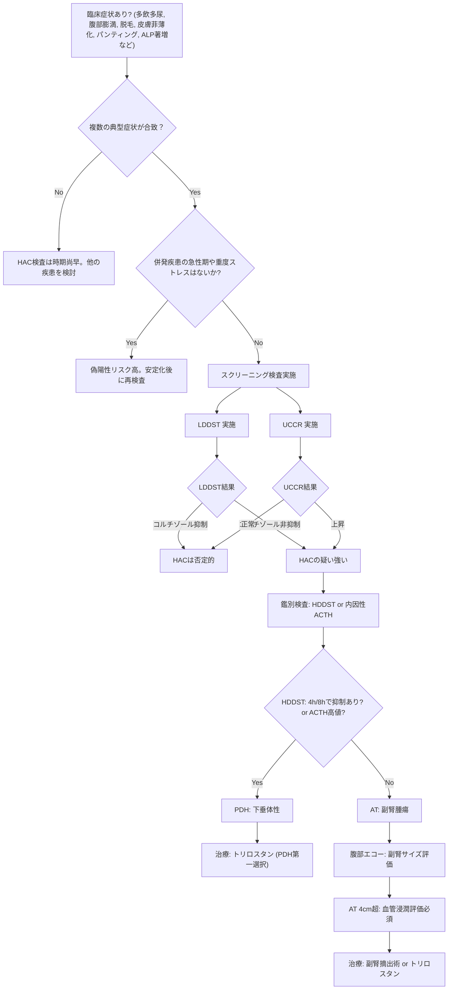

# 🔬 クッシング症候群 ─ 診断の落とし穴

> ⏱️ **読了時間**: 約5分
> 📄 **参照論文**: 7本

---

## 🎯 結論

クッシング症候群（HAC）の最大の落とし穴は 「偽陽性」 。
                    併発疾患（DM、CKD、肝疾患、ストレス）があると LDDS・ACTH刺激のどちらも偽陽性 になりうる。
                    原則: 臨床症状が合致しなければ検査しない 。
                    典型的な症状（多飲多尿・腹部膨満・脱毛・皮膚菲薄化・肝腫大）が複数揃って初めて検査を行う。 PDH（85%） とAT（15%）の鑑別にはLDDS 4時間・8時間値の評価と 腹部超音波 が有用。
                    治療はトリロスタン。日本での承認薬名は アドレスタン® （共立製薬）など。海外先発薬名は ベトリル®（Vetoryl） 。

---

## ⚡ スクリーニング検査の比較

| 検査 | 感度 | 特異度 | メリット | デメリット |
|:---|:---|:---|:---|:---|
| **LDDS** | 85〜100% | 40〜73% | 感度が高い。4/8h値でPDH/AT鑑別の手がかり | **偽陽性が多い** 。8時間の入院が必要 |
| **ACTH刺激試験** | 57〜95% | 59〜93% | 短時間（1〜2h）。医原性HACを検出 | AT由来HACの **感度が低い** |
| **UCCR** | ≒100% | 20〜30% | 最も感度が高い。自宅採尿で簡便 | **特異度が極めて低い** 。ルールアウト目的のみ |

⚠️ UCCRが正常 → HACをほぼ除外できる （感度≒100%）。ただし陽性ならHACとは限らない（特異度が低い）。 graph TD
    A["臨床症状あり? (多飲多尿, 腹部膨満, 脱毛, 皮膚菲薄化, パンティング, ALP著増など)"] --> B{"複数の典型症状が合致？"}
    B -->|"No"| C["HAC検査は時期尚早。他の疾患を検討"]
    B -->|"Yes"| D{"併発疾患の急性期や重度ストレスはないか?"}
    D -->|"Yes"| E["偽陽性リスク高。安定化後に再検査"]
    D -->|"No"| F["スクリーニング検査実施"]
    F --> G["LDDST 実施"]
    F --> H["UCCR 実施"]
    G --> I{"LDDST結果"}
    I -->|"コルチゾール抑制"| J["HACは否定的"]
    I -->|"コルチゾール非抑制"| K["HACの疑い強い"]
    H --> L{"UCCR結果"}
    L -->|"正常"| J
    L -->|"上昇"| K
    K --> M["鑑別検査: HDDST or 内因性ACTH"]
    M --> N{"HDDST: 4h/8hで抑制あり? or ACTH高値?"}
    N -->|"Yes"| O["PDH: 下垂体性"]
    N -->|"No"| P["AT: 副腎腫瘍"]
    O --> Q["治療: トリロスタン (PDH第一選択)"]
    P --> R["腹部エコー: 副腎サイズ評価"]
    R --> S["AT 4cm超: 血管浸潤評価必須"]
    S --> T["治療: 副腎摘出術 or トリロスタン"]

---

## 📚 参照論文

1. Behrend EN et al. Diagnosis of spontaneous canine hyperadrenocorticism:                                 2012 ACVIM consensus statement (small animal). **J Vet Intern Med** 2013;27(6):1292-1304.
2. Ramsey IK. Trilostane in dogs. **Vet Clin North Am Small Anim Pract** 2010;40(2):269-283.
3. Feldman EC, Nelson RW. Canine hyperadrenocorticism (Cushing's syndrome).                                 In: **Canine and Feline Endocrinology** , 4th ed, 2015.
4. Galac S et al. Urinary corticoid:creatinine ratios in the differentiation                                 between pituitary-dependent hyperadrenocorticism and                                 hyperadrenocorticism due to adrenocortical tumour in the dog. **Vet Q** 1997;19(1):17-20.
5. Arenas C et al. Long-term survival of dogs with adrenal-dependent                                 hyperadrenocorticism: a comparison between mitotane and twice daily                                 trilostane. **J Vet Intern Med** 2014;28(2):473-480.
6. Macfarlane L, Parkin T, Ramsey I. Pre-trilostane and three-hour post-trilostane                                 cortisol to monitor trilostane therapy in dogs. **Vet Rec** 2016;179(23):597.
7. Kaplan AJ et al. Effects of disease on the results of diagnostic tests                                 for use in detecting hyperadrenocorticism in dogs. **JAVMA** 1995;207(4):445-451.

---

tags: [内分泌, 副腎]
update: 2026-03-24