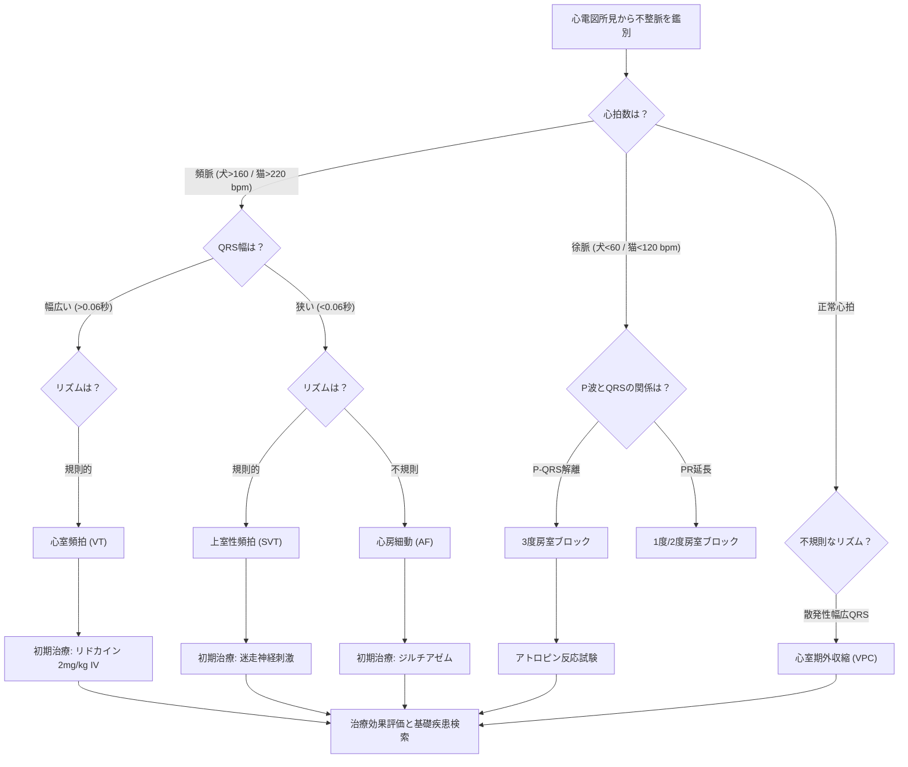

# ❤️ 不整脈の救急対応 ─ 心電図の読み方

> ⏱️ **読了時間**: 約5分
> 📄 **参照論文**: 7本

---

## 🎯 結論

救急で遭遇する不整脈の対応原則は 「不整脈そのものを治すのではなく、血行動態への影響を治療する」 。心室性期外収縮（VPC）の散発は治療不要だが、 持続性心室頻拍（VT:
                        HR＞160〜180
                        bpmかつ灌流低下） はリドカインの適応。上室性頻脈（SVT）は 迷走神経刺激（頸動脈洞マッサージ等。※眼球圧迫は網膜剥離や眼球損傷の重大なリスクがあるため現在は絶対禁忌） で診断的に鑑別し、反応がなければ薬物治療。徐脈（房室ブロック・洞不全症候群）は症候性なら アトロピン反応試験 を行い、反応なければペースメーカーの適応を検討。まず 不整脈の原因（電解質異常、GDV、低酸素、薬剤性など）を検索・是正 することが最優先。

---

## 🗺️ 救急不整脈 ─ 迅速鑑別フロー

| 心拍数 | QRS幅 | リズム | 考えるべき不整脈 | 初期治療 |
|:---|:---|:---|:---|:---|
| **頻脈**   (＞160 bpm) | **幅広い** | 規則的 | 心室頻拍（VT） | リドカイン 2mg/kg IV |
| **狭い** | 規則的 or 不整 | SVT / 心房細動（AF） | 迷走神経刺激 → ジルチアゼム |
| **徐脈**   (犬＜60 / 猫＜140 bpm) | 正常 | 規則的 | 洞徐脈 / 洞不全症候群 | アトロピン反応試験 |
| 正常〜幅広 | 不整 | 2度〜3度房室ブロック | アトロピン反応試験 → ペースメーカー検討 |

---

## ⚡ 昔の常識 vs 今のエビデンス

| ❌ 旧来 | ✅ 最新 |
|:---|:---|
| VPCが出たらすぐリドカイン | **散発性VPCは治療不要** 。持続性VTで血行動態に影響がある場合のみ治療。「R-on-T」も単独では治療指標にならない |
| 不整脈＝心臓の問題 | 救急不整脈の多くは **二次的原因** （電解質異常・低酸素・疼痛・脾臓疾患・GDV等）。原因治療が最優先 |
| リドカインが効かなければプロカインアミド | リドカイン不応のVTには **ソタロール（1〜2mg/kg PO BID）** が現在の選択肢。プロカインアミドは獣医領域での使用報告が減少 |
| 猫の不整脈は稀 | 猫でも心筋症に伴う不整脈（AF、VPC）は少なくない。ただし **猫の心電図判読は犬より記録が難しく、見落とされやすい** |

---

## 📚 参照論文

1. Moise NS. Diagnosis and management of canine arrhythmias. In: Tilley LP et al, eds. **Manual of Canine and Feline Cardiology** , 5th ed. Elsevier, 2016:310-340.
2. Côté E. Electrocardiography and cardiac arrhythmias. In: Ettinger SJ et al, eds. **Textbook of Veterinary Internal Medicine** , 8th ed. Elsevier, 2017:1140-1191.
3. Pedro B et al. Retrospective evaluation of the effect of sotalol on survival in Boxer                                 dogs with ventricular arrhythmias (2020). **J Vet Intern Med** 2020;34(3):1029-1039.
4. Wright KN et al. Supraventricular tachycardia in four young dogs. **J Am Vet                                     Med Assoc** 1996;208(1):75-80.
5. Gelzer AR et al. Combination therapy with digoxin and diltiazem for atrial fibrillation                                 in dogs (2009). **J Vet Intern Med** 2009;23(3):499-504.
6. Scansen BA et al. Temporary transvenous cardiac pacing in 28 dogs and 2 cats (2008). **J Vet Intern Med** 2008;22(6):1254-1261.
7. Tilley LP. **Essentials of Canine and Feline Electrocardiography** , 3rd ed. Lea &                                 Febiger, 1992.

---

tags: [循環器, 救急, 心電図, 不整脈]
update: 2026-03-24