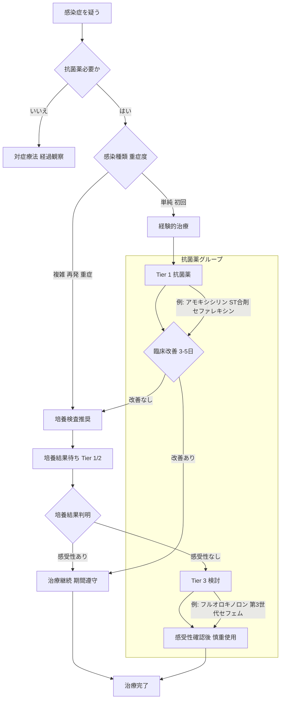

# 💊 抗菌薬選択の基本原則 ─ 臓器別アプローチ

> ⏱️ **読了時間**: 約5分
> 📄 **参照論文**: 6本

---

## 🎯 結論

抗菌薬は 「臓器 × 起因菌 × 第一選択」 の3軸で選ぶ。
                    まず第一選択薬（アモキシシリン、第一世代セフェム、ST合剤）を検討し、 フルオロキノロン・第三世代セフェムは最終手段 として温存する。
                    → 培養検査なしでの経験的治療は「単純症例 × 初回」に限る。 graph TD
    A["感染症を疑う"] --> B{"抗菌薬必要か"}
    B -->|"いいえ"| C["対症療法 経過観察"]
    B -->|"はい"| D{"感染種類 重症度"}

    D -->|"単純 初回"| E["経験的治療"]
    D -->|"複雑 再発 重症"| F["培養検査推奨"]

    E --> G["Tier 1 抗菌薬"]
    F --> H["培養結果待ち Tier 1/2"]

    G --> I{"臨床改善 3-5日"}
    H --> J{"培養結果判明"}

    I -->|"改善あり"| K["治療継続 期間遵守"]
    I -->|"改善なし"| F

    J -->|"感受性あり"| K
    J -->|"感受性なし"| L["Tier 3 検討"]

    L --> M["感受性確認後 慎重使用"]

    K --> N["治療完了"]
    M --> N

    subgraph 抗菌薬グループ
        G -->|"例: アモキシシリン ST合剤 セファレキシン"| I
        L -->|"例: フルオロキノロン 第3世代セフェム"| M
    end

---

## 🗺️ 臓器別 第一選択薬

| 臓器・疾患 | 第一選択 | 培養の要否 |
|:---|:---|:---|
| **散発性細菌性膌胱炎尿路感染症** | アモキシシリン   ST合剤 （スルファメトキサゾール・トリメトプリム） | 初回であっても可能な限り全例で培養を推奨 |
| **複雑性UTI尿路感染症** | 培養結果に基づく | **必須** |
| **表在性膿皮症** | 外用抗菌薬が第一   全身投与ならセファレキシン | 再発・難治例で |
| **猫上部気道** | 10日間の経過観察   →ドキシサイクリン | 通常不要 |
| **周術期予防** | セファゾリン IV   （執刀30分前） | 不要 |
| **歯科処置** | 原則不要   （全身疾患ある場合のみ） | 不要 |

---

## ⚡ 昔の常識 vs 今のエビデンス

| ❌ 旧来 | ✅ 最新 |
|:---|:---|
| UTIにはエンロフロキサシン | 散発性UTIにFQ（フルオロキノロン）は過剰。アモキシシリンで十分 |
| 膿皮症＝即内服抗菌薬 | 表在性なら外用療法（クロルヘキシジン等）が第一選択 |
| 猫の鼻水＝即抗菌薬 | ウイルス性が大半。10日間は経過観察が推奨 |
| 歯科処置前に抗菌薬予防投与 | 健康な犬猫では不要（心疾患等の既往がある場合のみ） |

---

## 📚 参照論文

1. AAFP/AAHA Antimicrobial Stewardship Guidelines (2022). **JAAHA**
2. Weese JS et al. ISCAID guidelines for UTI diagnosis and management in dogs and cats                                 (2019). **Vet J**
3. Hillier A et al. ISCAID guidelines for superficial bacterial folliculitis in dogs                                 (2014). **Vet Dermatol**
4. Lappin MR et al. ISCAID guidelines for respiratory tract disease in dogs and cats                                 (2017). **J Vet Intern Med**
5. Effect of institutional AMS guidelines on CIA prescribing in dogs and cats (2024). **J                                     Vet Intern Med**
6. Guardabassi L, Prescott JF. Antimicrobial Stewardship in Small Animal Veterinary                                 Practice: From Theory to Practice (2015). **Vet Clin North Am Small Anim Pract**

---

tags: [抗菌薬]
update: 2026-03-24