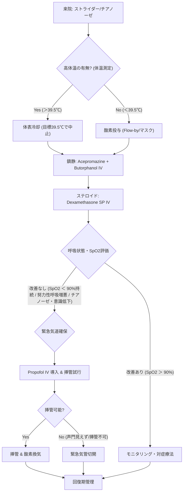

# 🚨 気道緊急 ─ 上気道閉塞・喉頭麻痺

> ⏱️ **読了時間**: 約5分
> 📄 **参照論文**: 6本

---

## 🎯 結論

上気道閉塞は「見て触って聴く」前にまず 鎮静 。努力性呼吸そのものが喉頭浮腫を悪化させる悪循環を断つことが最優先。 Acepromazine
                        0.005-0.02 mg/kg IV + Butorphanol 0.2-0.4 mg/kg
                        IV の低用量併用（Neuroleptanalgesia）で不安と呼吸努力を軽減する。高体温を伴う場合は 体表冷却（39.5℃で中止） を同時に行う。喉頭・咽頭浮腫に対し Dexamethasone
                        SP 0.1-0.2 mg/kg IV を単回投与。鎮静＋冷却＋ステロイドで改善しない場合、SpO2 < 90%が続く場合は、 Propofol 2-4
                        mg/kg IV での急速導入 → 挿管、または 緊急気管切開 を躊躇してはならない。

---

## 🚨 上気道閉塞 ─ 段階的対応プロトコル

| Step | 介入 | 薬剤・方法 |
|:---|:---|:---|
| **1** | 酸素投与 | Flow-by (2-3 L/min以上)。嫌がらなければマスク |
| **2** | 鎮静 | **ACP 0.005-0.02 mg/kg IV** + **Butorphanol 0.2-0.4 mg/kg IV** |
| **3** | 冷却（高体温時） | 体表冷却 → **39.5℃で中止** |
| **4** | ステロイド | **Dex SP 0.1-0.2 mg/kg IV** （単回） |
| **5** | 気道確保（改善なし時） | **Propofol 2-4 mg/kg IV → 挿管** 、または緊急気管切開 |

---

## 💉鎮静の意義 ─ なぜ「まず鎮静」なのか

上気道閉塞の患者は、呼吸困難 → 不安・パニック → さらに努力性呼吸 → 喉頭浮腫の悪化 → さらに閉塞 ──
                        という **致死的な悪循環** に陥る。この悪循環を断つ最も効果的な方法が鎮静である。

- **Acepromazine** (0.005-0.02 mg/kg IV):
                            フェノチアジン系。不安を軽減し、呼吸努力を減らす。低用量で十分な効果。ただし **血管拡張作用** があるため、循環血液量減少の患者では低血圧に注意
- **Butorphanol** (0.2-0.4 mg/kg IV): κオピオイド。軽度の鎮静作用と咳嗽反射の抑制。呼吸抑制作用が弱く、気道緊急に適している

- Dexmedetomidine等のα₂アゴニストは **嘔吐誘発作用** がある → 上気道閉塞下の嘔吐は誤嚥リスク
- 末梢血管収縮 → 体温放散を妨げる → 高体温の悪化

---

## 🧊冷却とステロイド ─ 浮腫と高体温への対処

- 高体温は酸素消費量を増大させ、喉頭浮腫を悪化させる
- 方法: 濡れタオル＋送風が最も効果的。冷却輸液も併用可
- **目標体温: 39.5℃ (103°F)** まで下がったら冷却中止 → 過冷却（Rebound hypothermia）を防ぐ
- 氷嚢の直接適用は末梢血管収縮を起こし、熱放散を妨げるため推奨しない

- **Dexamethasone SP 0.1-0.2 mg/kg IV** : 喉頭・咽頭の浮腫軽減目的。単回投与
- 代替: **Prednisolone Sodium Succinate 1-2 mg/kg IV**
- 効果発現までに30-60分を要するため、鎮静と並行して早期に投与する

---

## 🫁緊急気道確保 ─ 挿管と気管切開の判断

- 鎮静＋冷却＋ステロイドで **SpO2 < 90%が持続** する場合
- 努力性呼吸が増悪し、 **チアノーゼや意識レベル低下** が見られる場合

- **Propofol: 2-4 mg/kg IV to effect** （小分けにIVして効果を確認しながら）
- 代替: **Alfaxalone IV to effect**
- 挿管後は酸素100%で換気し、SpO2の回復を確認

- 喉頭展開しても声門が見えない、挿管不可能な場合 → **躊躇せず気管切開**
- 必要物品: メス（#10-15）、止血鉗子、気管チューブ（通常より1-2サイズ小さいもの）
- 一時的気管切開チューブの長期管理には看護が必要（加湿、吸引）

---

## 📚 参照論文

1. MacPhail CM. Laryngeal disease in dogs and cats: an update. **Vet Clin North Am Small                                 Anim Pract** 2020;50(2):295-310.
2. Millard RP, Tobias KM. Laryngeal paralysis in dogs. **Compend Contin Educ Vet** 2009;31(5):212-219.
3. Riecks TW et al. Surgical correction of brachycephalic syndrome in dogs: 62 cases                             (1991-2004). **J Am Vet Med Assoc** 2007;230(9):1324-1328.
4. Holt DE, Harvey CE. Upper airway obstruction surgery. In: Silverstein DC, Hopper K, eds. **Small Animal Critical Care Medicine** , 2nd ed. Elsevier, 2015:63-67.
5. Johnson LR, Pollard RE. Tracheal collapse and bronchomalacia in dogs: 58 cases                             (2001-2008). **J Vet Intern Med** 2010;24(2):298-305.
6. Grubb T et al. 2020 AAHA Anesthesia and Monitoring Guidelines for Dogs and Cats. **J Am                                 Anim Hosp Assoc** 2020;56(2):59-82.

---

tags: [救急, 呼吸器, 外科]
update: 2026-03-24