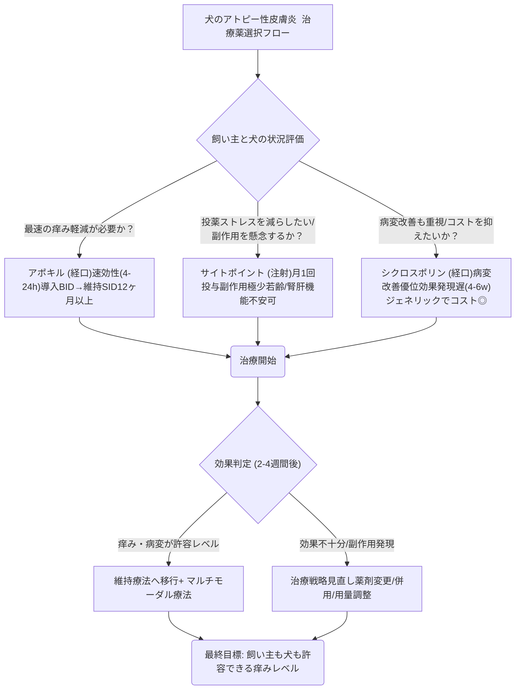

# 🩺 犬のアトピー性皮膚炎 ─ 最新治療薬比較

> ⏱️ **読了時間**: 約5分
> 📄 **参照論文**: 6本

---

## 🎯 結論

3薬剤とも痒みの軽減に有効だが、 速効性ならアポキル（4〜24時間）、注射1回で1ヶ月効くのがサイトポイント、病変改善ならシクロスポリン 。
                    → 単剤で不十分な場合はマルチモーダル（外用＋全身療法＋アレルゲン回避）が原則。「痒みゼロ」ではなく「飼い主も犬も許容できるレベル」が現実的なゴール。

---

## 🗺️ 3大治療薬 比較表

|  | アポキル (オクラシチニブ) | サイトポイント (ロキベトマブ) | シクロスポリン (アトピカ等) |
|:---|:---|:---|:---|
| **作用機序** | JAK（ヤヌスキナーゼ）阻害（IL-31（インターロイキン-31: 痒みを引き起こすサイトカイン）等） | 抗IL-31（インターロイキン-31）抗体 | カルシニューリン阻害 |
| **効果発現** | 4〜24時間 ⚡ | 1日以内 ⚡ | 4〜6週間 🐢 |
| **投与** | 経口 導入14日間BID→維持SID | 皮下注射 月1回 | 経口 1日1回 |
| **主な副作用** | 嘔吐・下痢   （まれに感染症↑） | 注射部位反応   （極めて少ない） | 消化器症状   歯肉増殖・乳頭腫 |
| **年齢制限** | 12ヶ月以上 | なし（日本:体重3.0kg以上） | 6ヶ月以上 |
| **日本国内** | ✅ 入手可 | ✅ 入手可 | ✅ 入手可（ジェネリックあり） |
| **月額目安** | 約8,000〜15,000円 | 約8,000〜20,000円 | 約5,000〜12,000円 |

---

## ⚡ 昔の常識 vs 今のエビデンス

| ❌ 旧来 | ✅ 最新 |
|:---|:---|
| アトピー＝ステロイドで管理 | 長期ステロイドは副作用リスク大。JAK（ヤヌスキナーゼ）阻害薬/抗体療法が第一選択に |
| 痒みがなくなったら治療終了 | アトピーは慢性疾患。マルチモーダルで生涯管理 |
| 食事変更だけで治る | 食物アレルギーは全体の10〜15%。除去食試験で鑑別が必要 |

---

## 📚 参照論文

1. Olivry T et al. Treatment of canine atopic dermatitis: updated guidelines (2015). **BMC Vet Res**
2. Little PR et al. Oclacitinib vs cyclosporine for canine atopic dermatitis: RCT (2015). **Vet Dermatol**
3. Moyaert H et al. Lokivetmab vs cyclosporine (non-inferiority RCT). **Vet Dermatol**
4. Marsella R. Update on CAD treatment 2024. **Today's Vet Practice**
5. Prolonged twice-daily oclacitinib dosing (2024 retrospective). **Vet Dermatol**
6. Oclacitinib and lokivetmab effects on skin barrier (2024). **Vet Immunol                                     Immunopathol**

---

tags: [皮膚科, アトピー, 皮膚, 免疫]
update: 2026-03-24