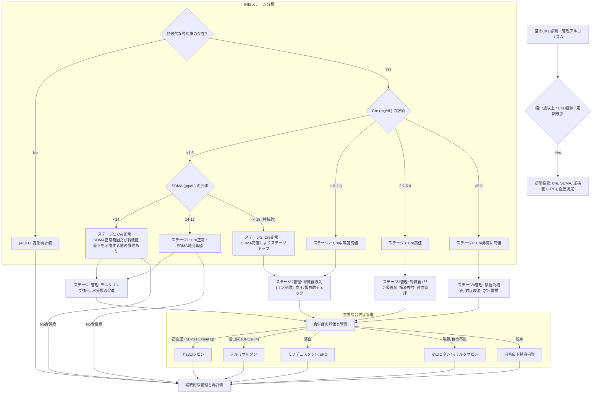

# 🫘 猫の慢性腎臓病（CKD）─ IRISステージ別管理

> ⏱️ **読了時間**: 約3分
> 📄 **参照論文**: 6本

---

## 🎯 結論

- **IRISステージ2から腎臓食を導入**。リン制限が進行抑制のカギ。
- SDMAはクレアチニンより早期に上昇するバイオマーカーで、ステージ1の発見に有用。
- 高血圧（収縮期≥160mmHg）にはアムロジピン、蛋白尿にはテルミサルタンを併用。

---

## 🗺️ IRISステージ別 管理方針

| ステージ | Cre (mg/dL) | 管理 |
|:---|:---|:---|
| **1** | <1.6 | モニタリング、水分摂取促進 SDMA 14〜17で注意 |
| **2** | 1.6〜2.8 | **腎臓食導入**、リン制限 血圧・蛋白尿チェック |
| **3** | 2.9〜5.0 | 腎臓食＋リン吸着剤 補液検討、貧血管理 |
| **4** | >5.0 | 積極的補液、対症療法 QOL重視の管理 |

---

## ⚡ 昔の常識 vs 今のエビデンス

| ❌ 旧来 | ✅ 最新 |
|:---|:---|
| 腎臓病＝極端なタンパク質制限 | 良質な中等度タンパク質で筋肉量維持。過度な制限は筋減少を招く |
| クレアチニンだけでステージング | SDMAを併用し早期ステージの見落としを防ぐ |
| 腎臓病の猫にリンは無関係 | リン制限は最も強いエビデンスを持つ進行抑制策 |

---

## 🔬 SDMAとクレアチニン ─ 早期発見の鍵

- SDMA: 腎機能が約25%低下で上昇開始
- クレアチニン: 腎機能が約75%低下するまで正常範囲内に留まりやすい
- SDMAは筋肉量の影響を受けにくく、痩せた高齢猫で特に有用
- IRIS分類では、クレアチニンが正常でもSDMAが持続的に≥18 μg/dLなら**ステージ２**と判定（SDMA 14〜17 μg/dLはステージ1）

**💡 臨床アクション**: 7歳以上の猫の定期検診にSDMAを含める。痩せた猫ではクレアチニンが過小評価されるため、SDMAが特に重要。

---

## 🍽️ 食事療法 ─ 腎臓食の科学的根拠

- 腎臓食はCKDの猫の生存期間を約2倍に延長（RCTで証明）
- 主な特徴: リン制限、良質中等度タンパク質、ナトリウム制限、オメガ3脂肪酸強化
- IRISステージ2で導入推奨
- 食べない腎臓食は意味がない → 段階的な切り替えが重要

**💡 臨床アクション**: 「一気に変える」のではなく7〜14日かけて混ぜながら移行。ウェットフードは水分補給も兼ねるため積極的に推奨。

---

## 💊 合併症管理 ─ 高血圧・貧血・嘔気

- **高血圧**（収縮期≥160mmHg）→ アムロジピン0.125-0.25mg/kg SID
- **蛋白尿**（UPC≥0.4）→ テルミサルタン1mg/kg SID
- **貧血** → モリデュスタット（経口の新薬）、従来のエリスロポエチン
- **嘔気・食欲不振** → マロピタント、ミルタザピン（経皮製剤あり）
- **脱水** → 自宅皮下補液の指導

**💡 臨床アクション**: すべてのCKD猫で血圧測定を。高血圧は網膜剥離・失明の原因になるが、治療可能な合併症。

---

## 🗣️ 飼い主への説明ガイド

**Q. 腎臓病は治るの？**
> 残念ながら腎臓の機能を元に戻すことはできませんが、食事療法とお薬で進行をゆっくりにして、快適に過ごせる期間を大幅に延ばすことができます。

**Q. 腎臓食を食べてくれない…**
> いきなり変えると嫌がることがあります。今のフードに少しずつ混ぜて、1〜2週間かけて切り替えましょう。温めると香りが立って食いつきが良くなることも多いです。

---

## 📚 参照論文（6本）

- IRIS Staging Guidelines for CKD (2023 update). *iris-kidney.com*
- Elliott J et al. Dietary therapy for feline CKD. *J Vet Intern Med*
- Hall JA et al. SDMA as a biomarker for kidney function. *JAVMA*
- Sparkes AH et al. ISFM（国際猫医学会） consensus on CKD diagnosis and management (2016). *J Feline Med Surg*
- Syme HM et al. Prevalence of hypertension in cats with CKD. *J Vet Intern Med*
- Ross SJ et al. Clinical evaluation of renal diets in CKD cats (RCT). *JAVMA*

---

tags: [腎泌尿器, 猫, CKD, 慢性腎臓病]
update: 2026-03-24
