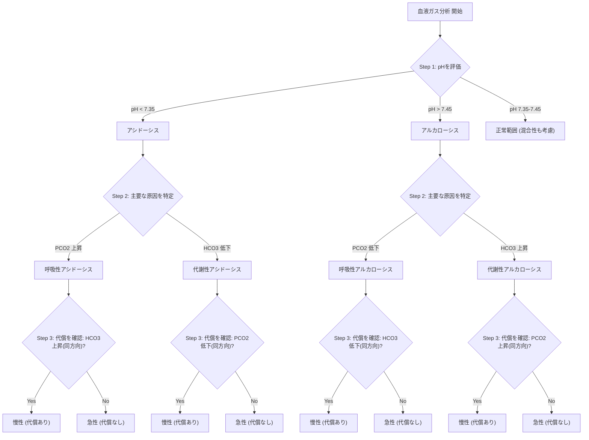

# 🧪 血液ガス分析の基本 ─ 3ステップ判読法

> ⏱️ **読了時間**: 約5分
> 📄 **参照論文**: 4本

---

## 🎯 結論 ─ 血ガスは3ステップで読める

Step 1: pHを見る （酸性？アルカリ性？） → Step 2:
                        原因を探す （呼吸性？代謝性？） → Step 3:
                        代償を確認 （体は補正しようとしているか？）。この3ステップで90%の症例は判読できる。静脈血ガスでも臨床上十分な情報が得られる（動脈採血は不要なことが多い）。

---

## 🗺️ 3ステップ判読フロー

| Step | 見る値 | 判断 |
|:---|:---|:---|
| **①** | pH | <7.35 → **アシドーシス**   >7.45 → **アルカローシス** |
| **②** | PCO2 / HCO3 | PCO2↑ → 呼吸性アシドーシス   PCO2↓ → 呼吸性アルカローシス   HCO3↓ → 代謝性アシドーシス   HCO3↑ → 代謝性アルカローシス |
| **③** | 代償の有無 | 代謝性 → PCO2が同方向に変化？   呼吸性 → HCO3が同方向に変化？   代償あり＝慢性、なし＝急性 |

---

## 📋 犬猫の正常値（動脈血/静脈血）

| 項目 | 動脈血 | 静脈血 |
|:---|:---|:---|
| **pH** | 7.35〜7.45 | 7.32〜7.40 |
| **PCO2** | 35〜45 mmHg | 35〜50 mmHg |
| **PO2酸素分圧** | 80〜110 mmHg | 30〜50 mmHg |
| **HCO3重炭酸イオン** | 20〜26 mEq/L | 20〜26 mEq/L |
| **BE塩基過剰** | -4〜+4 | -4〜+4 |
| **乳酸** | 犬: <2.5 mmol/L   猫: <2.0 mmol/L |

---

## ⚡ よくある症例パターン

| パターン | pH | PCO2 | HCO3 | 臨床例 |
|:---|:---|:---|:---|:---|
| **代謝性アシドーシス** | ↓ | ↓（代償） | ↓↓ | DKA（糖尿病性ケトアシドーシス）、ショック、腎不全、下痢 |
| **呼吸性アシドーシス** | ↓ | ↑↑ | ↑（代償） | 肺水腫、気道閉塞、麻酔中 |
| **代謝性アルカローシス** | ↑ | ↑（代償） | ↑↑ | 持続嘔吐、利尿剤過量 |
| **呼吸性アルカローシス** | ↑ | ↓↓ | ↓（代償） | 過換気、疼痛、発熱 |

---

## 🔬静脈血ガス vs 動脈血ガス ─ 本当に動脈じゃないとダメ？

- 酸塩基状態の評価（pH, HCO3, BE, 乳酸）→ **静脈血で十分**
- 酸化の評価（PaO2（動脈血酸素分圧）, A-a gradient（肺胞気・動脈血酸素分圧差: 肺のガス交換能を見る指標））→ 動脈血が必要
- 一般病院でルーチンに動脈採血する必要はほとんどない
- 静脈血のpHは動脈血より0.03〜0.05低い程度で、臨床判断に影響しない
- SpO2（パルスオキシメトリー）で酸素化は非侵襲的にモニタ可能

**💡 臨床アクション**: CEモニタや採血時に一緒に静脈血ガスを測定する習慣をつける。「動脈じゃないとダメ」はもう古い。乳酸値はショックの重症度判定と治療反応のモニタリングに最も有用。

---

## 📊アニオンギャップ ─ 代謝性アシドーシスの原因鑑別

- 正常値: 犬12〜24 mEq/L、猫13〜27 mEq/L
- **AG上昇型** （有機酸蓄積）: DKA、乳酸アシドーシス、腎不全（尿毒症毒素）、エチレングリコール中毒
- **AG正常型** （HCO3喪失）: 下痢、尿細管アシドーシス、大量生食投与後

**💡 臨床アクション**: 代謝性アシドーシスを見たらまずAGを計算。AG↑なら原因疾患の特定と治療が優先。AG正常なら「何がHCO3を奪っているか」を考える。ゴロ合わせ:**KULE**（Ketoacids（ケト酸）, Uremia（尿毒症）, Lactic acid（乳酸）, Ethylene
                            glycol（エチレングリコール））= AG上昇型の4大原因。

---

## 🏥ポータブル血ガス分析機 ─ 一般病院での導入

- **i-STAT（Abbott）** : 最も普及。カートリッジ式で血ガス＋電解質＋乳酸を2分で測定
- **VetScan i-STAT 1（Abaxis/Zoetis）** : 獣医向けに最適化されたi-STAT
- **epoc（Siemens）** : Bluetooth対応の新型ポータブル機
- コスト: 本体15〜30万円、カートリッジ1枚 約2,000〜3,000円
- 救急・重症患者の管理で劇的に診療の質が上がる

**💡 臨床アクション**: まずはショック疑い・DKA・腎不全・肺水腫の症例から使い始める。「乳酸値が下がった → 治療が効いている」という客観的指標が得られるだけで、診療の自信が変わる。

---

## 📚 参照論文

1. Hopper K et al. Blood gas and acid-base analysis in veterinary medicine. **Vet Clin North                                 Am Small Anim Pract**
2. Vanova-Uhrikova I et al. Venous vs arterial blood gas analysis in dogs. **J Vet Emerg Crit                                 Care**
3. Point-of-care blood gas analysis in veterinary practice (2024 review). **Today's Vet                                 Practice**
4. Lactate as a prognostic marker in critically ill dogs and cats. **J Vet Intern Med**

---

tags: [血液ガス, 酸塩基平衡, 血液]
update: 2026-03-24