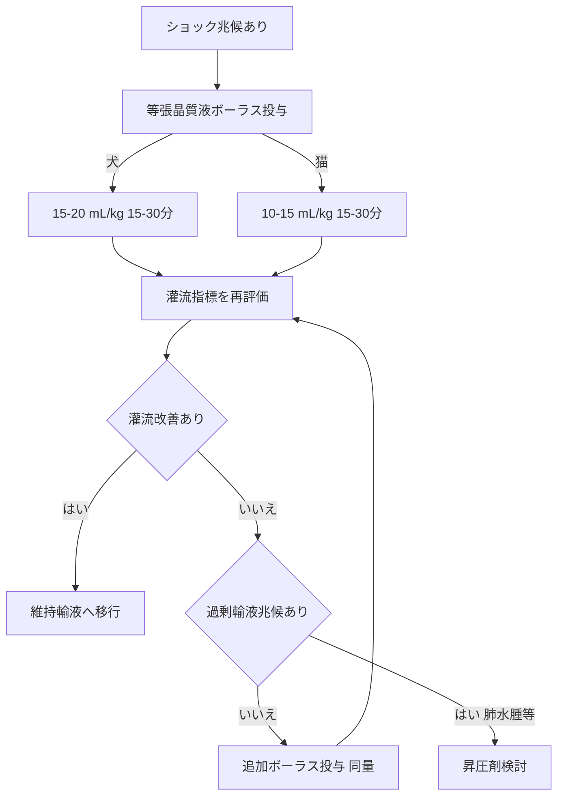

# 💧 輸液の基本 ─ 晶質液 vs 膠質液（2024 AAHA（米国動物病院協会）GL）

> ⏱️ **読了時間**: 約5分
> 📄 **参照論文**: 7本

---

## 🎯 結論

蘇生には 等張晶質液のボーラス投与 が第一選択（犬15〜20mL/kg、猫10〜15mL/kg）。「ショック量を一気に入れる」時代は終わり、 少量ボーラス→再評価→追加を繰り返す のが現在の標準。晶質液
                    vs 膠質液のどちらが優れるかのエビデンスは未確立。生理食塩水の大量投与は高クロール性代謝性アシドーシスのリスク → 緩衝晶質液（乳酸リンゲル等）が推奨 。猫は犬より過剰輸液に弱い。 graph TD
    A["ショック兆候あり"] --> B["等張晶質液ボーラス投与"]
    B -->|"犬"| C["15-20 mL/kg 15-30分"]
    B -->|"猫"| D["10-15 mL/kg 15-30分"]
    C --> E["灌流指標を再評価"]
    D --> E
    E --> F{"灌流改善あり"}
    F -->|"はい"| G["維持輸液へ移行"]
    F -->|"いいえ"| H{"過剰輸液兆候あり"}
    H -->|"いいえ"| I["追加ボーラス投与 同量"]
    H -->|"はい 肺水腫等"| J["昇圧剤検討"]
    I --> E

---

## 🗺️ ショック時の輸液ボーラス投与量

|  | 犬 🐕 | 猫 🐱 |
|:---|:---|:---|
| **等張晶質液** | 15〜20 mL/kg   15〜30分で投与 | 10〜15 mL/kg   15〜30分で投与 |
| **高張食塩水** | 4〜7 mL/kg   約10分 | 3〜4 mL/kg   約10分 |
| **膠質液（HES（ヒドロキシエチルデンプン: 人工膠質液）等）** | 5 mL/kg   5分で投与、反復可 | 2〜5 mL/kg   5分で投与 |
| **経験的ショック量（参考値）** | 90 mL/kg   （1/4〜1/3ずつ投与） | 50 mL/kg   （より少量ずつ） |

※ ショック量を一括投与しない。ボーラス → 灌流評価 →
                    追加判断を繰り返す

---

## ⚡ 昔の常識 vs 今のエビデンス

| ❌ 旧来 | ✅ 最新（2024 AAHA） |
|:---|:---|
| ショック量を一括投与 | 少量ボーラス＋再評価を反復 |
| 生食で何でもOK | 大量生食は高Cl性アシドーシスのリスク → 緩衝液推奨 |
| 維持にも等張液を使用 | 維持輸液には低張液を推奨（等張液の維持使用は電解質異常の原因に） |
| 膠質液は晶質液より優位 | 優位性は未証明＋AKI（急性腎障害）・凝固異常リスクの報告あり |

---

## 💉晶質液の種類と選択 ─ 生食 vs 乳酸リンゲル vs Plasma-Lyte

- **乳酸リンゲル (LRS)** : 最も汎用的。肝機能正常なら乳酸は速やかに代謝される
- **Plasma-Lyte A** : 電解質組成が血漿に最も近い。高カリウム血症リスクが低い
- **生理食塩水 (0.9% NaCl)** : Cl 154mEq/Lは血漿より高い → 大量投与で高Cl性アシドーシス
- 等張晶質液はIV投与後1時間以内に75%以上が血管外に移動する

**💡 臨床アクション**: 「とりあえず生食」はやめる。第一選択を**乳酸リンゲルまたはPlasma-Lyte**に。生食が適するのは高Ca血症・低ナトリウム血症・代謝性アルカローシスなどの限られた状況。

---

## 🐱猫の輸液 ─ 犬とは違う注意点

- 猫のショック: **徐脈 + 低体温 + 低血圧** （犬のように頻脈とは限らない）
- 猫は過剰輸液に非常に弱い → 犬と同じ速度で入れると肺水腫のリスク
- ボーラス量は10〜15 mL/kgで開始し、慎重に追加（AAHA 2024準拠）
- 心臓病の猫に気づかず輸液 → 致死的な医原性肺水腫のリスク

「猫は小さな犬ではない」。輸液速度を機械的に体重換算しない。5 mL/kgのボーラス後に必ず呼吸状態を再評価。

---

## 📊輸液モニタリング ─ 何を見て判断するか

- **HR** : 改善で正常化に向かう
- **CRT（毛細血管再充満時間）** : ＜2秒に改善
- **血圧** : MAP（平均動脈圧）≥60 mmHg
- **意識レベル** : 反応性の改善
- **乳酸値** : 最も客観的。＜2.5 mmol/Lが目標
- **尿量** : ≥1 mL/kg/h（十分な腎灌流の指標）
- **PCV/TS** : 過度の低下は希釈を示す

**💡 臨床アクション**: ボーラス投与後15〜30分で再評価。改善していれば維持輸液に移行。改善なしなら追加ボーラスまたはカテコラミン（ドーパミン/ノルエピネフリン）を検討。

---

## 📚 参照論文

1. AAHA Fluid Therapy Guidelines for Dogs and Cats (2024). **JAAHA**
2. Cazzolli D et al. The crystalloid-colloid debate: Consequences of resuscitation                             fluid selection in veterinary critical care (2015). **JVECC**
3. Davis H et al. Fluid therapy types and rates in dogs and cats. **Today's Vet Practice**
4. Silverstein DC et al. Colloids vs crystalloids in small animal resuscitation. **J Vet                                 Emerg Crit Care**
5. Fluid administration in cats with hypovolemic shock (2024). **AAHA guidelines                                 supplement**
6. Merck Vet Manual: Fluid therapy overview for animals. **merckvetmanual.com**
7. Mazzaferro EM. Fluid therapy in emergency practice. **Vet Clin North Am**

---

tags: [輸液, ショック, 血液]
update: 2026-03-24