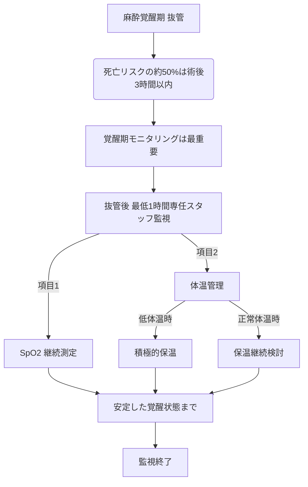

# 😴 麻酔モニタリング ─ ACVAA 2025年ガイドラインの要点

> ⏱️ **読了時間**: 約5分
> 📄 **参照論文**: 5本

---

## 🎯 結論

2025年ACVAA（米国獣医麻酔鎮痛学会）新ガイドラインの最大のメッセージは 「覚醒期の監視を手抜きするな」 。麻酔関連死の約50%は術後3時間以内に発生。3段階の推奨レベル（最低限/代替/高度）で施設規模に関わらず実践可能。健康な犬の麻酔死亡率は0.05%、健康な猫は0.11%、病気の犬は1.33%、病気の猫は1.40%（CEPSAF研究）。 graph TD
    A["麻酔覚醒期 抜管"] --> B("死亡リスクの約50%は術後3時間以内")
    B --> C["覚醒期モニタリングは最重要"]
    C --> D["抜管後 最低1時間専任スタッフ監視"]
    D -->|"項目1"| E["SpO2 継続測定"]
    D -->|"項目2"| F["体温管理"]
    F -->|"低体温時"| G["積極的保温"]
    F -->|"正常体温時"| H["保温継続検討"]
    E --> I["安定した覚醒状態まで"]
    G --> I
    H --> I
    I --> J["監視終了"]

---

## 🗺️ 3段階モニタリング推奨

| レベル | 項目 | 施設イメージ |
|:---|:---|:---|
| **最低限**   (Minimum) | 心拍数・呼吸数   SpO2・体温   麻酔深度評価   覚醒期の継続監視 | すべての一般病院 |
| **代替**   (Alternate) | 上記＋心電図   EtCO2（呼気終末CO2濃度: カプノグラフィ）   間接血圧 | 設備のある一般病院 |
| **高度**   (Advanced) | 上記＋直接動脈圧   神経筋モニタリング   吸入麻酔薬濃度 | 大学病院・専門病院 |

---

## ⚡ 2009年版 → 2025年版の変更点

| 2009年版 | 2025年版 ✅ |
|:---|:---|
| 覚醒期のモニタリング推奨なし | **覚醒後も継続モニタリングを強く推奨** |
| 鎮静時の指針なし | 鎮静（セデーション）専用の推奨を新設 |
| 画一的な推奨レベル | 3段階（最低限/代替/高度）で施設に合わせた柔軟な対応 |
| チェックリスト推奨なし | チェックリスト活用・チーム連携を強調 |

---

## ☠️覚醒期の死亡リスク ─ なぜ50%か

- 犬の麻酔関連死の47%、猫の61%、ウサギの64%が **術後に発生**
- 世界規模の解析: 犬の麻酔関連死の81%、猫の74.5%が覚醒後
- 覚醒期のリスク: 低体温 → 覚醒遅延、低酸素、不整脈
- 原因: スタッフが覚醒期に「手が空いて」別の業務に移ることが多い

**💡 臨床アクション**: 「抜管したら安心」は最大の誤解。最低でも抜管後1時間は専任スタッフがモニタリング。体温が36.5℃以下なら積極的保温。SpO2は覚醒まで継続測定。

---

## 📋チェックリスト ─ 航空業界に学ぶ安全文化

- **術前チェック** : 患者ID確認、絶食確認、既往歴確認、同意書確認、前投薬計画
- **導入時チェック** : 気管チューブサイズ確認、モニタ機器動作確認、緊急薬剤準備
- **術中チェック** : 5分ごとの記録、バイタル変動時のエスカレーション基準
- **覚醒チェック** : 抜管基準、体温、鎮痛評価

**💡 臨床アクション**: WHO手術チェックリストをベースに、貴院用にカスタマイズ。最低限「Time Out」（手術開始前の5秒確認）を導入するだけでヒューマンエラーが有意に減少。

---

## 📊ASA分類と死亡リスク

犬のリスク因子:
                        高齢、肥満、ASAスコア高値、緊急手術、短時間の手術（セットアップ不十分の可能性）。猫では悪液質、機械換気の使用、腹部/胸部/整形外科手術がリスク上昇。

---

## 📚 参照論文

1. ACVAA Small Animal Anesthesia and Sedation Monitoring Guidelines (2025). **Vet Anaesth                                 Analg**
2. AAHA Anesthesia and Monitoring Guidelines for Dogs and Cats (2020). **JAAHA**
3. Otero PE et al. Perioperative mortality in small animal anaesthesia (worldwide analysis,                             2024). **Vet Record**
4. Perioperative mortality risk factors in dogs (2024). **Vet Anaesth Analg**
5. Perioperative mortality risk factors in cats (2024). **Vet Anaesth Analg**

---

tags: [麻酔]
update: 2026-03-24